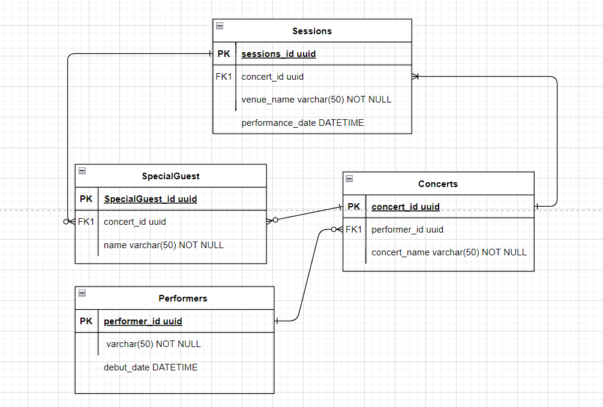

# 112-1 DataBase System 資料庫系統
> Teacher：蔡芸琤老師
> 
> Name：丁煦芊
> 
> Department & Grade：TAHRD 114

## Contents
* [Note](#Note)
* [Homework](#Homework)
* [Final-Project](#Final-Project)

## Note

## Homework
* [HW0-CRUD Tutorial (ReactJS, MySQL, NodeJS)](https://youtu.be/d7R-5fyi9g0)
* [HW1-ERD with my tables](https://youtu.be/L2LuY34XqNQ)
 
* [HW2-CRUD in Web App with My Table](https://youtu.be/CWgYBomYuLs)
* [HW3-CRUD in NoSQL With MongoDB (from My Table)](https://youtu.be/gpgQMq8sswY)

## Final-Project
